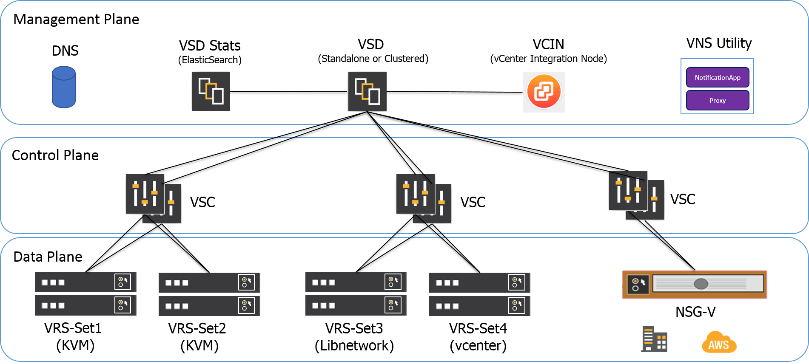

# Nuage Networks MetroAG Automation EnGine (AG)
## Overview
MetroAG is an automation engine used for deploying and upgrading Nuage Networks components. You specify the individual details for your target platform and MetroAG (built with Ansible playbooks and roles) executes the commands, deploying and configuring your components for you.

## Scope of Services
### Supported Platforms
You can automatically deploy and, in some cases, upgrade VCS/VNS components with the following target server types.
* KVM el7 (RedHat, CentOS)
* KVM el6 (RedHat, CentOS)
* ESXi (VMware)
* Ubuntu 14.04 (VRS only)
* Ubuntu 16.04 (VRS only)

Note: Ubuntu as a deployment target for new VMs (including VSD, VSC, VSD Stats) is no longer supported. VRS and Libnetwork continues to be supported for Ubuntu 14.04 and Ubuntu 16.04.

### Supported VSP Components
All supported components (except for VRS) are deployed as VMs.
* VSD (Virtualized Services Directory): clustered (HA) or stand-alone (SA)
* VSC (Virtualized Services Controller): one or more
* VRS (Virtual Routing & Switching) on existing nodes: one or more
* Libnetwork on VRS nodes to add Docker network support
* VSD Stats (ElasticSearch): one or more
* VNSUTIL (Virtualized Network Services - Utility) VM: one or more
* NSG-V (Network Services Gateway-Virtual): one
* VCIN (vCenter Integration Node): one
* DNS/NTP: one

MetroAG currently has fully tested and supported roles for the elements marked below.  

Install | Stand-alone (SA) | Clustered (HA) | KVM | ESXi 
------- | ---------------- | -------------- | --- | --- 
VSD | X | X | X | X 
VSC | X | X | X | X 
VSD Stats (ElasticSearch) | X | X | X | X
VCIN | X |  | X | X 
VNS-UTIL | X |  | X | X

Upgrade | KVM | ESXi
------- | --- | --- 
VSD | X | X | 
VSC |X | X |

## Ansible Playbooks and Roles  
**Ansible** provides a method to easily define one or more actions to be performed on one or more computers. These tasks can target the local system Ansible is running from, as well as other systems that Ansible can reach over the network. The Ansible engine has minimal installation requirements. Python, with a few additional libraries, is all that is needed for the core engine. MetroAG includes a few custom Python modules and scripts. Agent software is not required on the hosts to be managed. Communication with target hosts defaults to SSH. Ansible does not require the use of a persistent state engine. Every Ansible run determines state as it goes, and adjusts as necessary given the action requirements. Running Ansible requires only an inventory of potential targets, state directives, either expressed as an ad hoc action, or a series coded in a YAML file, and the credentials necessary to communicate with the target.

**Playbooks** are the language by which Ansible orchestrates, configures, administers and deploys systems. They are YAML-formatted files that collect one or more plays. Plays are one or more tasks linked to the hosts that they are to be executed on.   

**Roles** build on the idea of include files and combine them to form clean, reusable abstractions. Roles are ways of automatically loading certain vars files, tasks, and handlers based on a known file structure.

### MetroAG Playbooks and Roles
MetroAG playbooks and roles fall into the following categories:   

Playbook/Role | Description |
------------- | ----------- |
Predeploy | prepares infrastructure with necessary packages and makes the component(s) reachable |
Deploy | installs and configures component(s) |
Postdeploy | performs integration checks, and some basic commissioning tests |
Health | checks health for a running component without assuming it was deployed with MetroAG |
Destroy | removes component(s) from the infrastructure |
Upgrade | upgrades component(s) from one release to another |
Rollback | restores component(s) to their previous version (if an upgrade fails) |

## Workflow
First, if you haven't already done so, [set up the Nuage MetroAG Ansible environment](Documentation/SETUP.md) on the host on which MetroAG is to be run.

Second, [specify the individual details](Documentation/BUILD.md) for your particular system.

Third, if the components have not previously been deployed on your system, it's time to [deploy](Documentation/DEPLOY.md). Otherwise, you can [upgrade](Documentation/UPGRADE.md) to a newer version.

## Documentation
The [Documentation](Documentation/) directory contains the following guides to assist you in successfully working with MetroAG.  

File name | Description
--------- | --------
[BUILD.md](Documentation/BUILD.md) | Populate variables for your specific environment, unzip Nuage software, and execute the build.
[CONTRIBUTING.md](Documentation/CONTRIBUTING.md) | Submit your code and become a contributor to Nuage MetroAG.
[DESTROY.md](Documentation/DESTROY.md) | Remove existing deployment(s) and start over.
[DEPLOY.md](Documentation/DEPLOY.md) | Deploy all VSP components or choose components individually.
[OPENSTACK.md](Documentation/OPENSTACK.md) | Deploy VSP components in OpenStack (limited support).
[RELEASE_NOTES.md](Documentation/RELEASE_NOTES.md) | New features, resolved issues and known limitations and issues
[ROLLBACK.md](Documentation/ROLLBACK.md) | Restore VSP components to their previous version if an upgrade fails.
[SETUP.md](Documentation/SETUP.md) | Set up your environment by cloning the repo, installing packages and configuring access.
[UPGRADE.md](Documentation/UPGRADE.md) | Upgrade component(s) from one release to the next.

## Questions, Feedback and Contributing
Ask questions and get support on the [nuage-metro-interest@list.nokia.com](mailto:nuage-metro-interest@list.nokia.com "send email to nuage-metro project") mailing list.   

Report bugs you find and suggest new features and enhancements via the [GitHub Issues](https://github.com/nuagenetworks/nuage-metro/issues "nuage-metro issues") feature.
 
You may also [contribute](Documentation/CONTRIBUTING.md) to Nuage MetroAG by submitting your own code to the project.
 
## License
TBD
